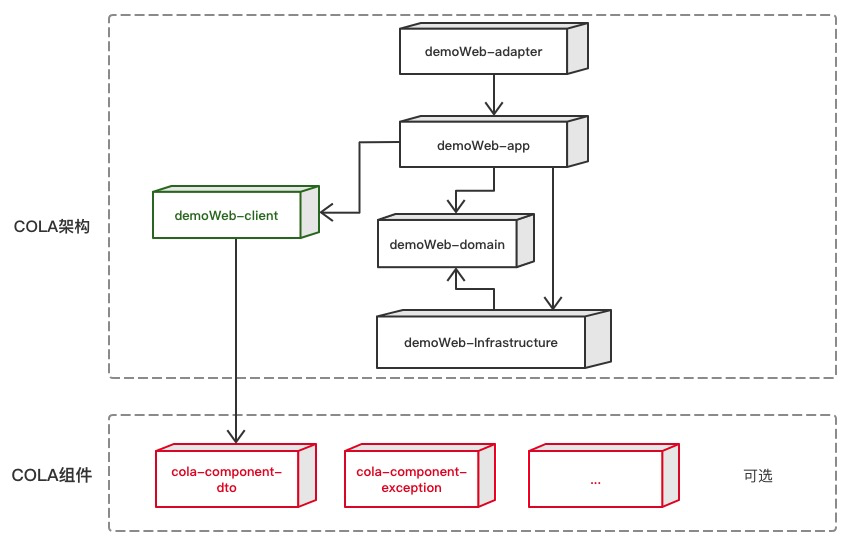

# cola-ddd-example
| 层次                                      | 包名          | 功能                        | 必选   |
|-----------------------------------------|-------------|---------------------------| ------ |
| Adapter层                                | web         | 处理页面请求的Controller         | 否     |
| Adapter层                                | wireless    | 处理无线端的适配                  | 否     |
| Adapter层                                | wap         | 处理wap端的适配                 | 否     |
| App层                                    | executor    | 处理request，包括command和query | 是     |
| App层                                    | consumer    | 处理外部message               | 否     |
| App层                                    | scheduler   | 处理定时任务                    | 否     |
| Domain层                                 | model       | 领域模型                      | **否** |
| Domain层                                 | ability     | 领域能力，包括DomainService      | **否** |
| Domain层                                 | gateway     | 领域网关，解耦利器                 | 是     |
| Infra层                                  | gatewayimpl | 网关实现                      | 是     |
| Infra层                                  | mapper      | ibatis数据库映射               | 否     |
| Infra层                                  | config      | 配置信息                      | 否     |
| Client SDK                              | api         | 服务对外透出的API，application层实现 | 是     |
| Client SDK                              | dto         | 服务对外的DTO                  | 是     |
| 第三放的不依赖模型的工具包(所有包都可以使用，依赖，也可以最外层的pom引用) | [tools](tools)       | 服务对外的DTO                  | 是     |
